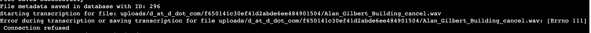

## Bug Report Introduction
During the development process, systematically recording and tracking bugs is essential for ensuring software quality and maintaining project progress. This document is intended to provide a structured format for reporting bugs encountered throughout the project lifecycle.

|Field | Description|
|-------|-----------|
|Bug ID | A unique identifier for each bug (e.g., BUG-20250415-01)|
|Description | A clear explanation of the bug and its symptoms|
|Reproduction Steps | Step-by-step guide to consistently reproduce the issue|
|Reporter | The team member who discovered the bug|
|Assignee | The person responsible for investigating/fixing the bug|
|Status | The current state of the bug (e.g., Open, In Progress, Fixed, Closed)|
|Fix / PR Link | Related pull request or commit resolving the issue|
|Final Notes | Any additional context, remarks, or links|

Using a consistent reporting template helps the team collaborate more efficiently when identifying issues, confirming fixes, and referencing past problems.

All team members are encouraged to log bugs as soon as they are discovered and to keep the status updated, ensuring transparency throughout the bug's lifecycle.

## In-Progress Fixing Bug
- BUG-20250402-02
- BUG-20250409-02
- BUG-20250409-03
- BUG-20250413-01

## Bug ID: BUG-20250319-01

**Description**: On project startup, when uploading a file for transcription, a "connection refused" error is displayed. The issue occurs because Celery is not running.

**Reproduction Steps**:
1. Start the backend server.
2. Start the React frontend.
3. Navigate to the Transcription page.
4. Enter a valid email address and select the desired output format and transcription language.
5. Upload an audio file.
6. Click the Upload Button.
7. The system displays a "connection refused" error.
8. Investigation reveals that Celery is not running.
9. To resolve the issue, execute the following commands in the backend environment:
    ```
    celery -A config beat -I info
    celery -A config worker -I info
    ```
    
10. Restart the file upload process to confirm the issue is resolved.

**Reporter**: Jiangyu Chen && Fuhui Yang

**Assignee**: Jiangyu Chen && Fuhui Yang

**Status**: Closed

**Fix / PR Link**: N/A

**Final Notes**: Ensure that the Celery commands are run in the backend environment to properly initialize the task queue and avoid connection errors during the transcription process.

## Bug ID: BUG-20250320-01

**Description**: Frontend error - The "Submit" button on the transcription page can be clicked multiple times in quick succession, causing the backend to process the same request repeatedly.

**Reproduction Steps**:
1. Navigate to the transcription page of the application.

2. Upload a valid audio file.

3. Click the Submit button multiple times quickly.

4. Observe that each click triggers a new request to the backend, causing the transcription process to run multiple times for the same file.


**Reporter**: Claire Shou

**Assignee**: Lecheng Chen

**Status**: Closed 

**Fix / PR Link**: 

**Final Notes**: The users are not allowed to click multiple times in quick succession.


## Bug ID: BUG-20250324-01

**Description**: A typo found during the unit test

**Reproduction Steps**:
1. Navigate to `/code/frontend/src/about/about.js`
2. There is a typo: "Transcription Aid Plaltform"

```javascript
<section className="hero-section">
    <h3> Transcription Aid Plaltform</h3>
    <p>Everything you need to transcribe audio filesat your fingertips.0ur platform is 100% free and easy to use!Upload, process, and receive your transcriptions with justa few clicks -no login reguired. Identify different speakershandle multiple files, and receive results directly via email.</p>
</section >
```

**Reporter**: Tianyi Zhong

**Assignee**: Tianyi Zhong

**Status**: Closed 

**Fix / PR Link**: [Commit 5a9baa7](https://github.com/fuhui14/SWEN90017-2024-TAP/commit/5a9baa7faa462f89be1942dae213b3d3ab4ad9bf) 

**Final Notes**: Adjust typo on About.js and finish unit test


## Bug ID: BUG-20250326-01

**Description**: The user can still clicks the button while uploading the files

**Reproduction Steps**:
1. Run the backend server, with following command, under code/backend path
```
python manage.py run server
``` 
2. Run the React frontend with following command:
```
cd code/frontend
npm run start
```
3. Go to Transcription page
4. Input correct Email address
5. Select desired format for the output file
    - txt for example
6. Select transcription language
    - English for example
7. Upload an auido file
8. Click Upload Button
9. Keep clicking upload button
9. Error happens


**Reporter**: Claire Shou

**Assignee**: Lecheng Chen

**Status**: Closed 

**Fix / PR Link**: [Commit c25caeb](https://github.com/fuhui14/SWEN90017-2024-TAP/commit/c25caebdb403a61084a4971a6bbae3a1acfaf0ab) 

**Final Notes**: Update transcriptionresult.css

## Bug ID: BUG-20250402-01

**Description**: Backend error - Can not find the file under given path when using winddows system to transcribe the audio file

**Reproduction Steps**:
1. Run the backend server, with following command, under code/backend path
```
python manage.py run server
``` 
2. Run the React frontend with following command:
```
cd code/frontend
npm run start
```
3. Go to Transcription page
4. Input correct Email address
5. Select desired format for the output file
    - txt for example
6. Select transcription language
    - English for example
7. Upload an auido file
8. Click Upload Button
9. Transcription error happens


**Reporter**: Yongjie Ba

**Assignee**: Yongjie Ba

**Status**: Closed 

**Fix / PR Link**: [Commit 9ebbde8](https://github.com/fuhui14/SWEN90017-2024-TAP/commit/9ebbde852291db6c91831ea3ba378828e9729e61) 

**Final Notes**: fix the windows bug


## Bug ID: BUG-20250402-02

**Description**: When uploading an audio file, the system is expected to recognize three speakers but incorrectly identifies five speakers. The current approach involves optimizing the speaker identifier; however, a specific solution is still under investigation.

**Reproduction Steps**:
1. Start the backend server and frontend application.
2. Navigate to the Transcription page.
3. Upload an audio file known to contain three speakers.
4. Observe that the speaker identification incorrectly reports five speakers.
5. Note that further optimization of the speaker identifier is required to accurately detect the correct number of speakers.

**Reporter**: Zixuan Zhang && Claire

**Assignee**: Zixuan Zhang && Claire

**Status**: In Process

**Fix / PR Link**: N/A

**Final Notes**: Optimization of the speaker identifier is underway, and the team is actively seeking a specific solution to resolve the issue.


## Bug ID: BUG-20250403-01

**Description**: On the history records page, when a user enters their email, the backend encrypts it and sends an encrypted link to the user's email. However, upon clicking the link, an error is displayed. The issue arises because the backend was restarted during the process, resulting in a newly generated encryption key that differs from the one used to encrypt the email. Consequently, the decryption fails. The resolution involved switching to a fixed encryption key stored on the server to prevent decryption failures due to backend restarts.

**Reproduction Steps**:
1. Navigate to the history records page.
2. Enter an email address.
3. The backend encrypts the email and sends an encrypted link to the provided email address.
4. Restart the backend before clicking the link (or observe that a restart occurred automatically).
5. Click the encrypted link received in the email.
6. The link fails to open correctly due to a decryption error caused by a mismatch in the encryption key.

**Reporter**: Jiangyu Chen

**Assignee**: Jiangyu Chen

**Status**: Closed

**Fix / PR Link**: N/A

**Final Notes**: The encryption key has been changed to a fixed value and stored on the server, ensuring that backend restarts do not affect the decryption process of the encrypted links.

## Bug ID: BUG-20250406-01

**Description**: On the history records page, clicking the download button fails to download the corresponding history record. The backend logs indicate that the query could not find the expected data. Investigation revealed that the backend was incorrectly accessing the uploaded files database instead of the translation records database, resulting in an inability to retrieve the record based on its ID. The issue was resolved by modifying the query to access the correct database table.

**Reproduction Steps**:
1. Navigate to the history records page.
2. Click the download button for a specific history record.
3. Observe that the download fails and the backend logs indicate no matching record was found.
4. Confirm that the backend is querying the wrong database table (uploaded files instead of translation records).
5. Apply the fix by updating the backend to query the correct database table.
6. Verify that the download function now retrieves the correct history record.

**Reporter**: Jiangyu Chen && Yingrong Chen

**Assignee**: Jiangyu Chen

**Status**: Closed

**Fix / PR Link**: N/A

**Final Notes**: The backend was updated to query the translation records database instead of the uploaded files database, resolving the issue and ensuring that the correct history record is downloaded.

## Bug ID: BUG-20260408-01
**Description**: On the deployed Droplet, submitting a transcription request with a moderately large audio file fails with the error 413 Request Entity Too Large. This indicates that the uploaded file exceeds the maximum request body size allowed by Nginx. As a result, the request is rejected before it reaches the Django backend.

**Reproduction Steps**:
1. Deploy the backend and Nginx server on a Droplet.
2. Open the transcription page on the frontend.
3. Upload an audio file larger than 1MB (e.g., a WAV file).
4. Click the Submit button.
5. Observe the error in the browser console or network logs:
    - POST http://www.transaid.software/api/transcription/ net::ERR_FAILED 413 (Request Entity Too Large)


**Reporter**: Zixuan Zhang

**Assignee**: Claire Shou

**Status**: Closed

**Fix / PR Link**: N/A

**Final Notes**: Edited the Nginx to allowed upload size to 20MB (adjust as needed), larger files can be successfully uploaded and processed by the backend.


## Bug ID: BUG-20250409-01

**Description**: The drop-file area overlapping with upload button when adjusting page

**Reproduction Steps**:
1. Run the backend server, with following command, under code/backend path
```
python manage.py run server
``` 
2. Run the React frontend with following command:
```
cd code/frontend
npm run start
```
3. Go to Transcription page
4. Adjusting page by customizing the window size
5. Overlapping happends

**Reporter**: Yongjie Ba

**Assignee**: Yongjie Ba

**Status**: Closed 

**Fix / PR Link**: [Commit bf7c7aa](https://github.com/fuhui14/SWEN90017-2024-TAP/commit/bf7c7aa98363b94136ccd7906cac22897eb94691) 

**Final Notes**: Update transpage.css to fix overlap for the drag and drop box and button


## Bug ID: BUG-20250409-02

**Description**: The email content is formatted incorrectly. The transcription content should not appear directly in the email body but should be attached as a file.

**Reproduction Steps**:
1. Initiate a transcription process.
2. Upon completion, check the email received by the user.
3. Notice that the transcription content is embedded in the email body instead of being provided as an attachment.
4. Verify that the expected behavior is to send the transcription content as an attached file.
5. Update the email formatting logic to include the transcription file as an attachment.

**Reporter**: Fuhui Yang

**Assignee**: Fuhui Yang

**Status**: In process

**Fix / PR Link**: 

**Final Notes**: The email formatting has been corrected so that the transcription content is now delivered as an attachment, ensuring the email body remains clear and follows the intended format.

## Bug ID: BUG-20250409-03

**Description**: In the transcription file received by the user, the speaker labels are incorrectly numbered starting from 0. The speaker labels should start from 1 (i.e., speaker1) instead of 0.

**Reproduction Steps**:
1. Complete a transcription process.
2. Open the transcription file received as an attachment.
3. Observe that the speaker labels begin with "speaker0" instead of "speaker1".
4. Update the transcription logic to ensure that speaker numbering starts at 1.
5. Verify that the speaker labels in the output file now correctly start from "speaker1".

**Reporter**: Zixuan Zhang

**Assignee**: Zixuan Zhang

**Status**: In process

**Fix / PR Link**: 

**Final Notes**: The speaker labeling has been updated so that numbering starts at 1, aligning with the expected output format.

## Bug ID: BUG-20250411-01
**Description**: The backend deployment on the Droplet fails to connect to Redis during transcription processing, resulting in a [Errno 111] Connection refused error. Despite Redis appearing to be active and listening on both IPv4 and IPv6, the backend is unable to establish a connection. This issue causes transcription jobs to fail and prevents email notifications from being sent.

**Reproduction Steps**:
1. Deploy the application (backend, Redis, Celery) on the Droplet server.
2. Start the Redis server (confirm it's running and listening on both IPv4 and IPv6, e.g., via lsof -i :6379).
3. Start the backend Django service and Celery worker.
4. Navigate to the transcription page on the frontend.
5. Upload a valid audio file and click the Submit button.
6. Monitor backend logs.
7. Observe the error:
    - [Errno 111] Connection refused when trying to connect to Redis.
    - Internal Server Error: /transcription/ as a result.

**Reporter**: Zixuan Zhang

**Assignee**: Claire Shou

**Status**: Closed

**Fix / PR Link**: N/A

**Final Notes**: Changed Redis URL on settings.py.


## Bug ID: BUG-20250413-01

**Description**: The backend deployment on the Droplet is not working. When attempting to start a transcription, the following error occurs:



**Reproduction Steps**:
1. Deploy the backend and frontend on the Droplet server.
2. Navigate to the transcription page via the frontend.
3. Upload a valid audio file and click the Submit button.
4. Observe the server logs on the backend.
5. Notice the following errors in the backend logs:
    - [Errno 111] Connection refused during transcription or saving.
    - [Errno 101] Network is unreachable when attempting to send an email.
    - Internal Server Error: /transcription/ returned as a response.

**Reporter**: Claire Shou

**Assignee**: Zixuan Zhang

**Status**: In process

**Fix / PR Link**: 

**Final Notes**: 