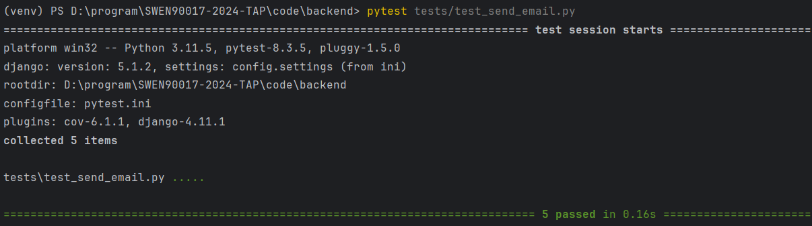
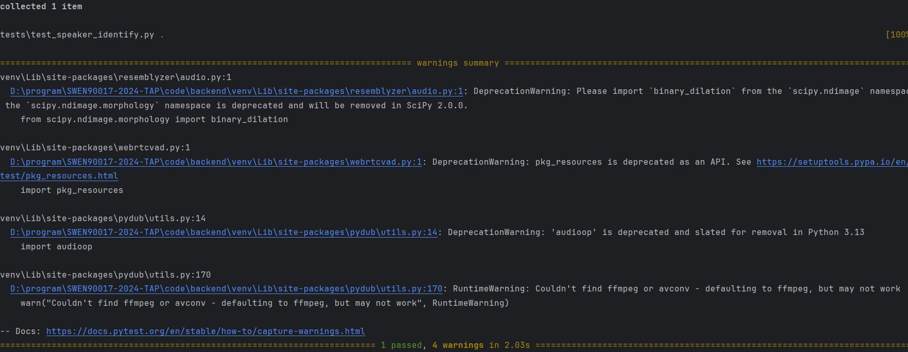
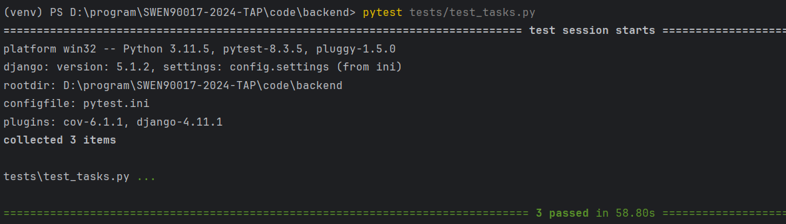
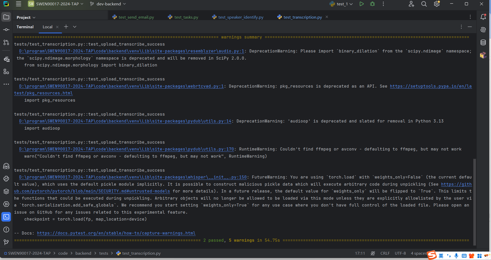

# Unit Test: Backend

---

## 1. test_send_email.py

### **Test Case 1: Send email with TXT, DOCX, and PDF attachments**
- **Description**: Ensures that the `send_email()` function correctly attaches and sends different file types.
- **Expected Behavior**: The SMTP client is called and the temporary file is deleted after sending.
- **Test Code Snippet**:
```python
send_email(receiver=email, file_type=file_type, ...)
mock_smtp.assert_called_once()
assert not file_path.exists()
```

### **Test Case 2: Send email with no attachment**
- **Description**: Verifies the function behaves correctly when no attachment is included.
- **Expected Behavior**: SMTP process still completes.
- **Test Code Snippet**:
```python
send_email(file_type=FileType.NONE)
mock_smtp.sendmail.assert_called_once()
```

### **Test Case 3: Handle SMTP errors gracefully**
- **Description**: Ensures `send_email()` doesn’t crash on SMTP failures.
- **Expected Behavior**: No exception raised during SMTP failure.
- **Test Code Snippet**:
```python
@mock.patch("smtplib.SMTP", side_effect=Exception("SMTP server error"))
send_email(...)
```



---

## 2. test_speaker_identify.py

### **Test Case: Full speaker transcription flow**
- **Description**: Simulates the speaker transcription pipeline: preprocessing, embedding, clustering, segmenting, and transcribing.
- **Expected Behavior**: Returns a list of speaker segments with text.
- **Test Code Snippet**:
```python
result = transcribe_with_speaker(...)
assert isinstance(result, list)
assert result[0]["text"] == "Hello world"
```



---

## 3. test_tasks.py

### **Test Case 1: Transcription + Email success**
- **Description**: Creates mock transcription record and sends email.
- **Expected Behavior**: Email is triggered, and success string returned.
- **Test Code Snippet**:
```python
process_transcription_and_send_email(...)
mock_send_email.assert_called_once()
```

### **Test Case 2: Invalid transcription ID**
- **Description**: Tests edge case where transcription ID doesn’t exist.
- **Expected Behavior**: Error string is returned.
- **Test Code Snippet**:
```python
result = process_transcription_and_send_email(9999)
assert "not found" in result
```

### **Test Case 3: Cleanup expired files**
- **Description**: Deletes files older than 90 days using fixed frozen time.
- **Expected Behavior**: Old file is removed, new file is kept.
- **Test Code Snippet**:
```python
assert File.objects.filter(email="expired@example.com").count() == 0
assert "1" in result or "deleted" in result
```



---

## 4. test_transcription.py

### **Test Case 1: Upload and transcribe success**
- **Description**: Simulates uploading a valid audio file with a valid email.
- **Expected Behavior**: Returns 200 with a transcription result.
- **Test Code Snippet**:
```python
response = client.post(reverse("transcribe"), {...})
assert response.status_code == 200
```

### **Test Case 2: Form validation failure**
- **Description**: Sends POST request with invalid email format.
- **Expected Behavior**: Returns 400 with error message.
- **Test Code Snippet**:
```python
response = client.post(reverse("transcribe"), {"email": "invalid"})
assert response.status_code == 400
```



---

## 5. test_history.py

TODO

---

## 6. test_history_login.py

TODO

---

## 7. test_translation.py

TODO